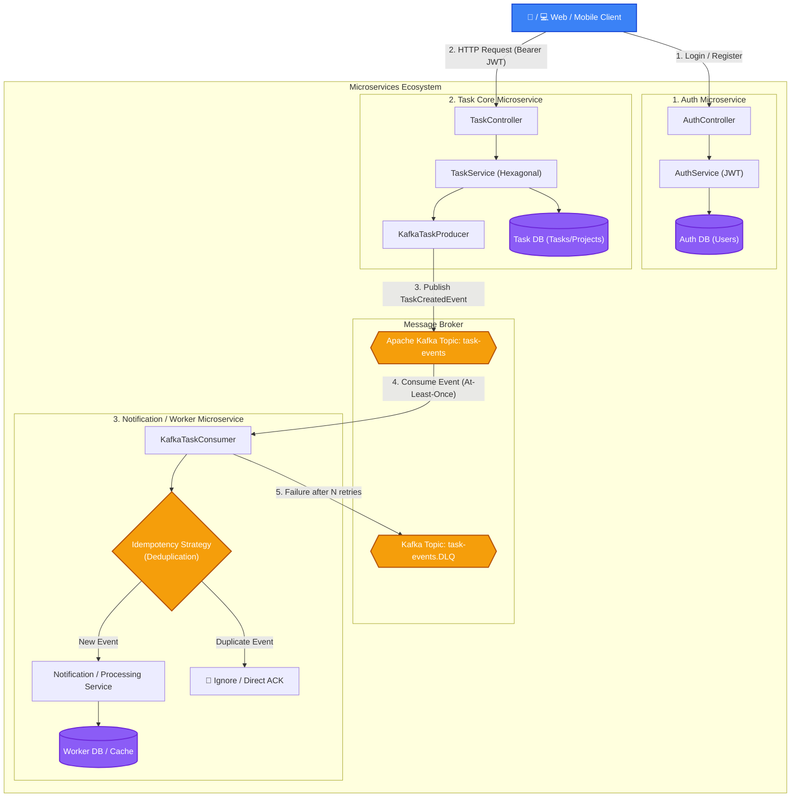

# Task Management API
## 🏛️ Distributed System Architecture



A RESTful task management API built with Spring Boot 4, following hexagonal architecture principles. Supports task and project management with JWT-based authentication and event-driven notifications via Apache Kafka.

## Features

- **CRUD operations** for tasks and projects, with relationships between them
- **Hexagonal architecture** — clear separation between domain, application, and infrastructure layers
- **JWT authentication** — user registration, login, and protected endpoints
- **Event-driven messaging** — publishes `TaskCreatedEvent` to Kafka on task creation, with a dedicated consumer and dead-letter queue (DLQ) error handling
- **Input validation** with descriptive error responses via a global exception handler
- **Unit and integration tests** — service layer tested with JUnit 5 and Mockito, controller layer tested with MockMvc

## Tech Stack

- **Java 21**
- **Spring Boot 4** (Spring Framework 7)
- **Spring Data JPA** + H2 (in-memory database)
- **Spring Security** + JWT (jjwt)
- **Apache Kafka** (Spring for Apache Kafka)
- **JUnit 5 / Mockito / AssertJ**
- **Docker** (multi-stage build)
- **Maven**

## Architecture

The project follows hexagonal (ports & adapters) architecture:

domain/ → Core business models (Task, Project, User)
app/
port/in/ → Input ports (use case interfaces)
port/out/ → Output ports (repository interfaces)
service/ → Application services implementing the use cases
infra/
in/web/ → REST controllers, DTOs, mappers
out/persistence/ → JPA entities, repositories, adapters
out/messaging/ → Kafka producers/consumers
security/ → JWT filter and service
config/ → Security and Kafka configuration

## API Endpoints

| Method | Endpoint              | Description                  | Auth required |
|--------|------------------------|-------------------------------|----------------|
| POST   | `/auth/register`       | Register a new user           | No             |
| POST   | `/auth/login`          | Authenticate and get a JWT    | No             |
| POST   | `/tasks`                | Create a task                 | Yes            |
| GET    | `/tasks/{id}`           | Get a task by ID              | Yes            |
| PUT    | `/tasks/{id}`           | Update a task                 | Yes            |
| DELETE | `/tasks/{id}`           | Delete a task                 | Yes            |
| GET    | `/tasks/project/{id}`   | Get all tasks for a project   | Yes            |

## Running Locally

```bash
mvn clean package
docker build -t task-management-service .
docker run -p 8080:8080 task-management-service
```

The API will be available at `http://localhost:8080`.

## Live Demo

Deployed on AWS EC2 using Docker. All `/tasks/**` endpoints require JWT authentication.

> Note: uses an in-memory H2 database, so data resets on container restart.

## Testing

```bash
mvn test
```

Covers the service layer (business logic, mocked repository/Kafka producer) and the controller layer (HTTP status codes, request validation).
